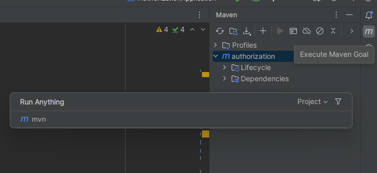

Add next sections to POM.xml

- Отключаем *maven-deploy-plugin*. Edit POM.xml

```java
<plugin>
   <groupId>org.apache.maven.plugins</groupId>
   <artifactId>maven-deploy-plugin</artifactId>
   <version>${maven-deploy-plugin.version}</version>
   <configuration>
      <skip>true</skip>
   </configuration>
</plugin>
```

- И определяем *nexus-staging-maven-plugin*. Also in POM.xml

`````java
<plugin>
   <groupId>org.sonatype.plugins</groupId>
   <artifactId>nexus-staging-maven-plugin</artifactId>
   <version>1.6.13</version>
   <executions>
      <execution>
         <id>default-deploy</id>
         <phase>deploy</phase>
         <goals>
            <goal>deploy</goal>
         </goals>
      </execution>
   </executions>
   <configuration>
      <serverId>nexus</serverId>
      <nexusUrl>http://188.235.13.36:8081/nexus/</nexusUrl>
      <skipStaging>true</skipStaging>
   </configuration>
</plugin>
`````

`<skipStaging>true</skipStaging>` - by this we can fully disable staging functionality and simply deploy of *-SNAPSHOT* artifacts

- Define the credentials of the server. Open **settings.xml** of *maven*


```java
<server>
	<id>nexus-snapshots</id>
	<username>deployment</username>
	<password>deploypassword</password>
</server>
```

**deployment/deploypassword** - it is our credentials

- Define remote repository for SNAPSHOTs. Edit POM.xml

  ```java
  	<distributionManagement>
  		<repository>
  			<id>nexus</id>
  			<name>nexus-releases</name>
  			<url>http://188.235.13.36:8081/repository/maven-releases/</url>
  		</repository>
  		<snapshotRepository>
  			<id>nexus-snapshots</id>
  			<name>nexus-snapshots</name>
  			<url>http://188.235.13.36:8081/repository/maven-snapshots/</url>
  		</snapshotRepository>
  	</distributionManagement>
  ```

- Next, we define the nexus active profile of maven. and here are [some options](https://habr.com/ru/articles/114861/) 

```java
    <profiles>
    <profile>
        <id>nexus</id>
        <repositories>
            <repository>
                <id>nexus</id>
                <name>nexus-repository</name>
                <url>http://188.235.13.36:8081/repository/maven-public/</url>
                <releases>
                    <enabled>true</enabled>
                </releases>
                <snapshots>
                    <enabled>true</enabled>
                </snapshots>
            </repository>
        </repositories>
        <pluginRepositories>
            <pluginRepository>
                <id>nexus</id>
                <name>nexus-repository</name>
                <url>http://188.235.13.36:8081/repository/maven-public/</url>
                <releases>
                    <enabled>true</enabled>
                </releases>
                <snapshots>
                    <enabled>true</enabled>
                </snapshots>
            </pluginRepository>
        </pluginRepositories>
    </profile>
</profiles>
<activeProfiles>
	<activeProfile>nexus</activeProfile>
</activeProfiles>
```

Nothing else.

Run now 



Write:

`mvn clean deploy -Dmaven.test.skip=true -Dmaven.plugin.validation=brief -e -X`

`-e` - produce execution error messages

`-X` - produce execution debug output

 


Go to nexus in browser in see the next:


